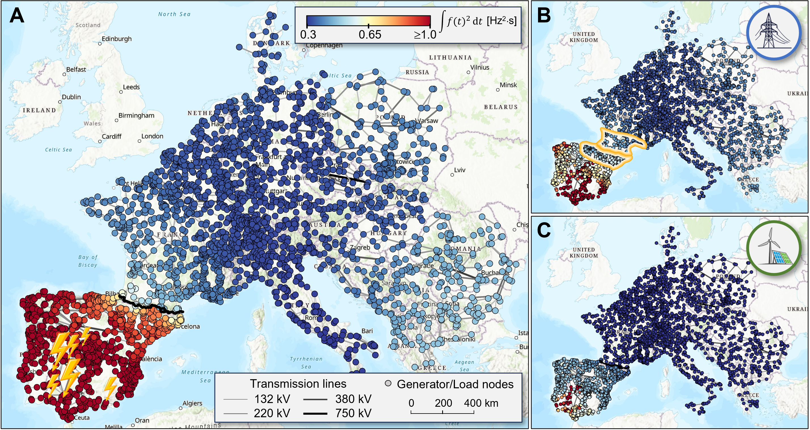
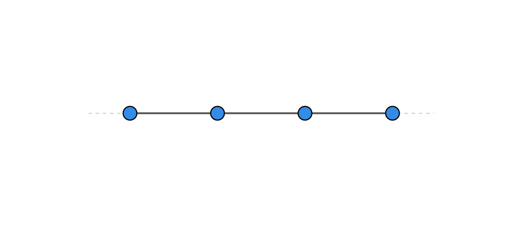
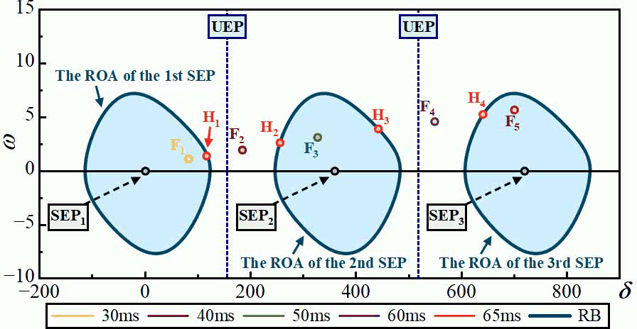
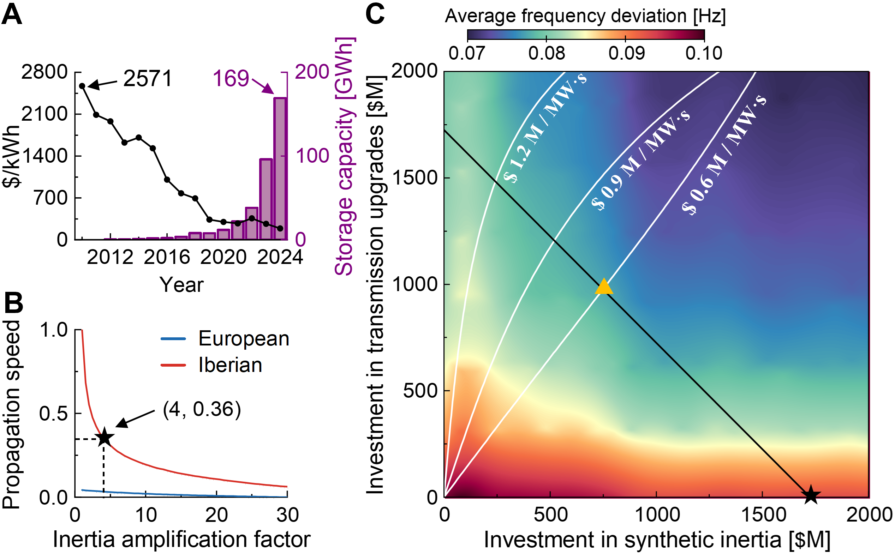
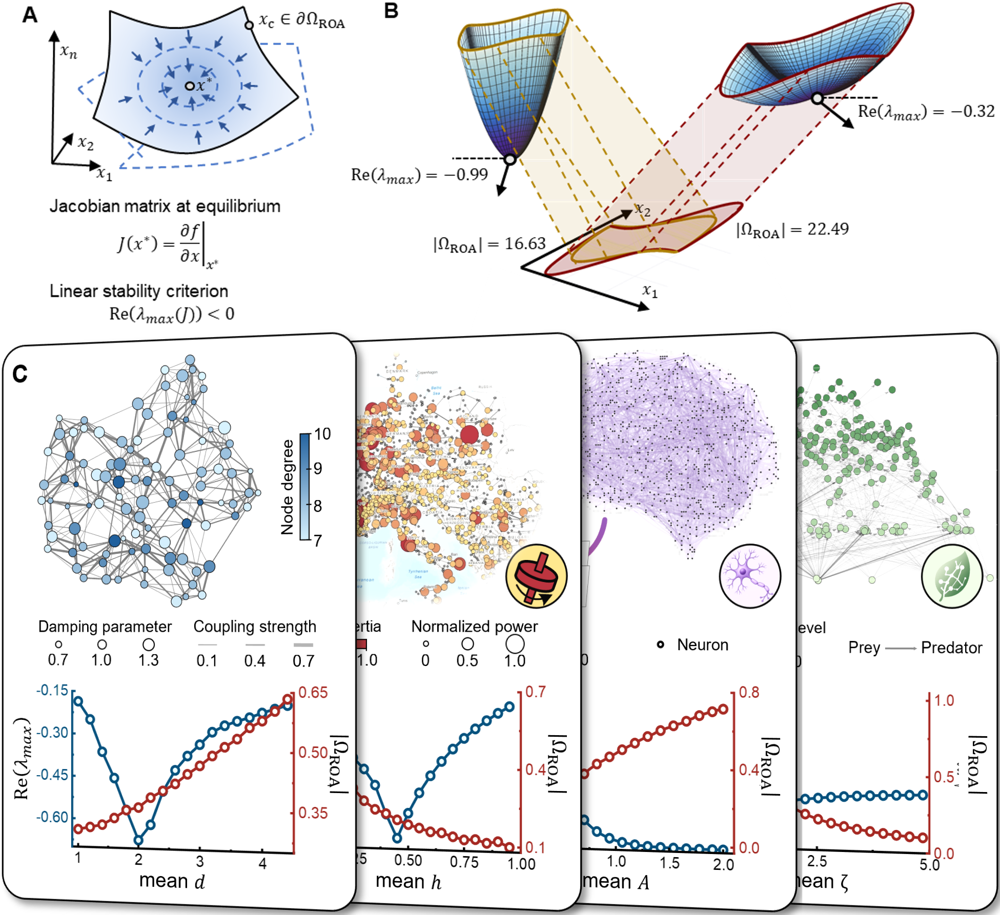
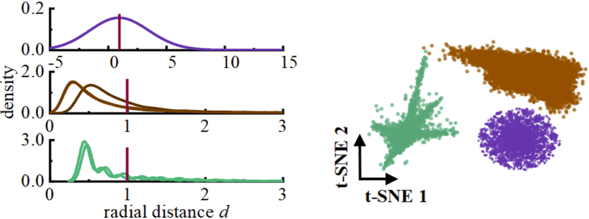
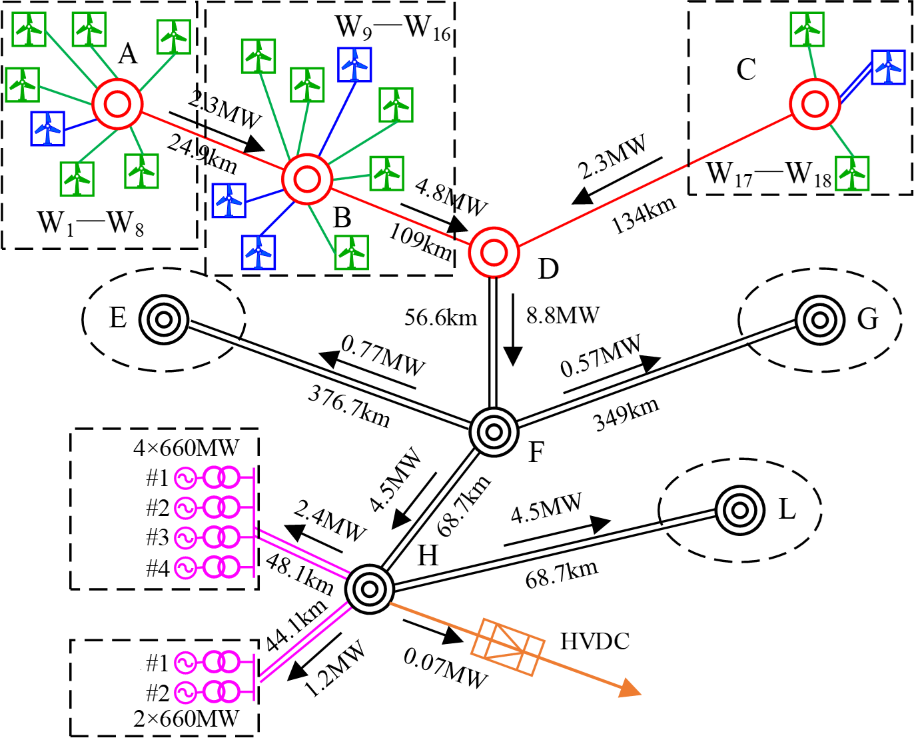
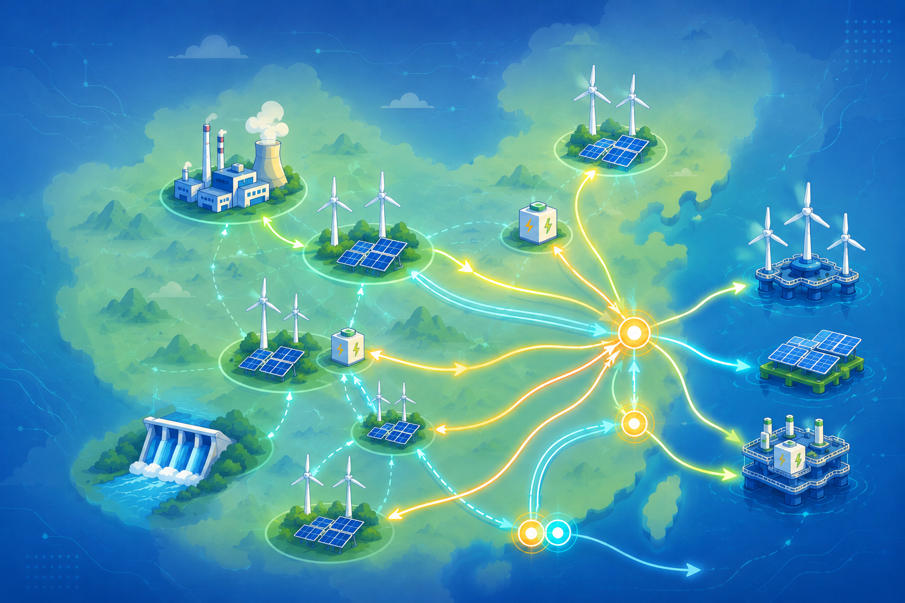

```{=html}
<div class="research-sections">
<section class="research-part">
<button class="research-part-title" type="button" aria-expanded="false">Emerging Instability in Renewable-Rich Power Systems</button>
<div class="research-part-content" hidden>
<div class="research-feature">
<div class="research-feature-text">
<p>The 2025 Iberian blackout exposed a fundamental question in network dynamics: How can a localized disturbance generate nonlocal amplification far from its origin, even across thousands of kilometers? Our research shows that this seemingly counterintuitive phenomenon arises from the intrinsic nonnormal dynamics of renewable-rich power grids. In related work, we have further explored the broader dynamical consequences of renewable integration, revealing emerging phenomena such as multistability, evolving stability boundaries, limiter-induced switching, and transitions from equilibrium-dominated to limit-cycle-dominated instability.</p>
<p>Our studies reveal that renewable integration creates new dynamical trade-offs: it can both enhance system resilience and introduce new pathways to instability. Understanding and managing these trade-offs is essential for achieving both decarbonization and grid modernization. By combining advanced control strategies, such as synthetic inertia, with infrastructure upgrades, future power systems can become both cleaner and more resilient without sacrificing one for the other.</p>
<div class="research-references">
<div class="research-references-title">References</div>
<ol>
<li><u>Y. Wang</u>, A. N. Montanari, A. E. Motter. Rethinking the Green Power Grid for Stability, Not Just for Climate. <em>Joule</em>, 10: 102522 (2026).</li>
<li><u>Y. Wang</u>, A. N. Montanari, A. E. Motter. Nonnormal Frequency Dynamics in Renewable-Rich Power Grids. Under review.</li>
<li><u>Y. Wang</u>, S. Xu, H. Sun, et al. Transient Stability Analysis of the CIG-Embedded Power Systems Considering Multiple Stable Equilibrium Points. <em>IEEE Trans. on Power Systems</em>, 40(2): 1518-1531 (2025).</li>
<li><u>Y. Wang</u>, S. Xu, H. Sun, et al. Stability Boundary of Power System with Converter Interfaced Generation: Evolution and Transition Point. <em>IEEE Trans. on Power Systems</em>, 40(1): 893-906 (2025).</li>
<li>S. Xu, <u>Y. Wang</u>, H. Sun, et al. Insights from Renewable Energy Outage Accidents Abroad for Secure and Stable Operation of Power Grids in China. <em>Automation of Electric Power Systems</em>, 48(13): 1-8 (2024).</li>
<li><u>Y. Wang</u>, H. Sun, S. Xu, et al. Transient Stability Analysis and Improvement for the Grid-Connected VSC System with Multi-Limiters. <em>IEEE Trans. on Power Systems</em>, 39(1): 1979-1995 (2024).</li>
</ol>
</div>
</div>
<div class="research-figure-stack">
<figure class="research-figure">

</figure>
<figure class="research-figure">

</figure>
<figure class="research-figure">

</figure>
<figure class="research-figure">

</figure>
</div>
</div>
</div>
</section>

<section class="research-part">
<button class="research-part-title" type="button" aria-expanded="false">Complex Resilience Originates from Rank-One Organization</button>
<div class="research-part-content" hidden>
<div class="research-feature">
<div class="research-feature-text">
<p>My recent research shows that resilience under perturbations, traditionally viewed as a high-dimensional problem, is governed by an underlying low-rank organization. Our mathematical analysis establishes that this low-rank organization is shared across a broad range of natural and engineered systems, providing a unified dynamical mechanism for directional vulnerability, multistability, and critical transitions.</p>
<p>It opens new directions for analyzing and engineering resilience in large-scale complex systems, enabling scalable analysis, reliable prediction, and principled control under perturbations.</p>
<div class="research-references">
<div class="research-references-title">References</div>
<ol>
<li><u>Y. Wang</u>, A. N. Montanari, A. E. Motter. The Rank-One Origin of Resilience in Complex Systems. In preparation.</li>
<li><u>Y. Wang</u>, A. N. Montanari, A. E. Motter. Distributed Lyapunov Functions for Nonlinear Networks. <em>IEEE Control Systems Letters</em>, 9: 486-491 (2025).</li>
</ol>
</div>
</div>
<div class="research-figure-stack">
<figure class="research-figure">

</figure>
<figure class="research-figure">

</figure>
</div>
</div>
</div>
</section>

<section class="research-part">
<button class="research-part-title" type="button" aria-expanded="false">Physics-Based Modeling of Heterogeneous Power Systems</button>
<div class="research-part-content" hidden>
<div class="research-feature">
<div class="research-feature-text">
<p>Future power systems are rapidly evolving into heterogeneous dynamical networks, driven by renewable integration, power electronics, and emerging large-scale loads. Recent oscillation events worldwide highlight the growing challenge of accurately modeling their complex dynamics. Our research develops physics-based dynamical models spanning frequencies from 0.1 Hz to 10 kHz, enabling systematic analysis of heterogeneous generation and load dynamics.</p>
<p>These models have reproduced multiple real-world grid disturbances, including the recent western China power-grid disturbance, and have been deployed through commercial decision-support software in regional power grids across China. We further integrate physics-based modeling with intelligent monitoring to enable condition assessment and early fault warning of critical power equipment. As future grids continue to evolve with AI data centers, electrified transportation, and renewable energy, these efforts provide the analytical and monitoring capabilities needed to ensure that future power systems remain secure, reliable, and resilient.</p>
<div class="research-references">
<div class="research-references-title">References</div>
<ol>
<li>B. Qi, <u>Y. Wang</u>, P. Zhang, et al. A Novel Self-Decision Fault Diagnosis Model Based on State-Oriented Correction for Power Transformer. <em>IEEE Trans. on Dielectrics and Electrical Insulation</em>, 27(6): 1778-1786 (2020).</li>
<li>H. Sun, <u>Y. Wang</u>, L. Gao, et al. Research on Unification Stability Criterion for the Power Electronics Dominated Power System (II): Criterion of the Power-Electronic Interfaced Subsystem. <em>Proceedings of the CSEE</em>, 42(6): 2060-2069 (2022).</li>
<li>H. Sun, <u>Y. Wang</u>, L. Gao, et al. Research on Unification Stability Criterion for the Power Electronics Dominated Power System (I): Criterion of the Power-Electronic Interfaced Plant. <em>Proceedings of the CSEE</em>, 42(5): 1713-1723 (2022).</li>
<li>B. Qi, <u>Y. Wang</u>, P. Zhang, et al. A Novel Deep Recurrent Belief Network Model for Trend Prediction of Transformer DGA Data. <em>IEEE Access</em>, 7: 80069-80078 (2019).</li>
</ol>
</div>
</div>
<div class="research-figure-stack">
<figure class="research-figure">

</figure>
<figure class="research-figure">

</figure>
</div>
</div>
</div>
</section>
</div>

<script>
document.addEventListener("DOMContentLoaded", () => {
  const parts = document.querySelectorAll(".research-part");

  parts.forEach((part) => {
    const button = part.querySelector(".research-part-title");
    const content = part.querySelector(".research-part-content");

    button.addEventListener("click", () => {
      const shouldOpen = !part.classList.contains("is-active");

      parts.forEach((otherPart) => {
        const otherButton = otherPart.querySelector(".research-part-title");
        const otherContent = otherPart.querySelector(".research-part-content");
        const isSelected = shouldOpen && otherPart === part;

        otherPart.classList.toggle("is-active", isSelected);
        otherButton.setAttribute("aria-expanded", String(isSelected));
        otherContent.hidden = !isSelected;
      });
    });
  });
});
</script>
```
